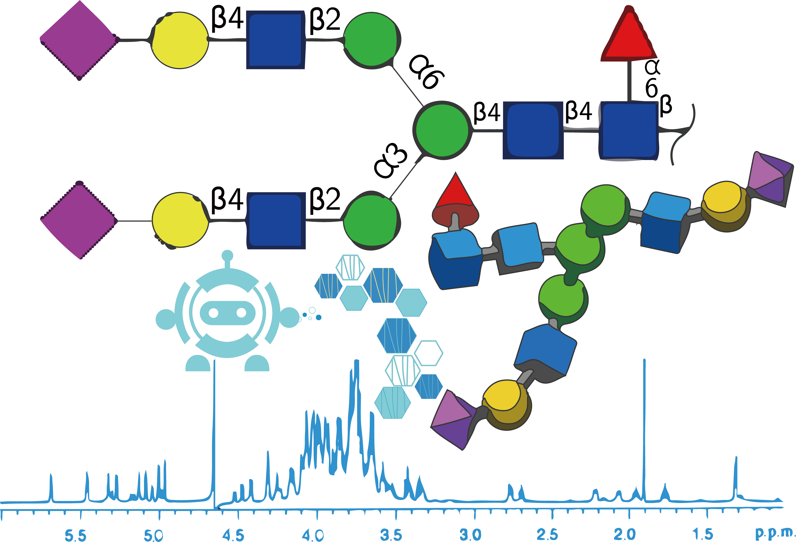
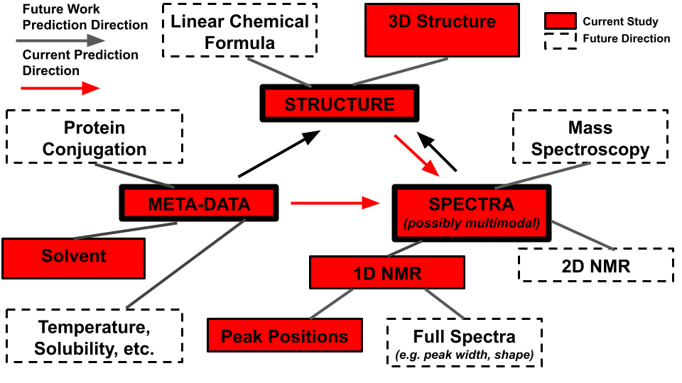

<p align='center'>
  
</p>

# GlycoNMR

Data repository for the manuscript titled: "GlycoNMR: Dataset and benchmarks for NMR Shift prediction on carbohydrates". 

## Datasets:

The two curated datasets discussed in the paper, click the link to download each one. 

### 1. Collected and simulated carbohydrate datasets (uncurated, before ML pipeline): 

The raw datasets in format of Protein Data Bank (PDB) 3D coordinate structure files with corresponding NMR shift files. Designed for glycoscience researchers with standard format for experimental files.

This raw data is difficult and risky to use as is in machine learning research, as we have done substantial curation after obtaining this raw data. For ML pipelines, please instead use the downloads "2. Processed carbohydrate datasets" below. We have just provided this raw uncurated data for completion and openness.

All raw data was accessible through publicly available sources that allowed open use as long as proper citation was given.

- GODESS experimentally-informed simulation data can be downloaded [here](https://drive.google.com/file/d/15qIixe-irZyJKzvuoINuK1-d53nC8Jyh/view?usp=sharing) and was obtained from http://csdb.glycoscience.ru/goddess.html, see our manuscript and http://csdb.glycoscience.ru/database/index.html?help=nmr#citation for more information <br />

- The complete list of chemical formulae of the carbohydrates included in our GODESS dataset can be viewed in text format here: [GODESS_Chemical_formula.csv](https://anonymous.4open.science/r/GlycoNMR-D381/GODESS_Chemical_formula.csv)

- See appendix of manuscript for higher level summaries of the data.

- Glycosciences.DB experimental data can be downloaded [here](https://drive.google.com/file/d/1z6OMzvvALq8rOZBWAW5C9yBr_UBQ__ZT/view?usp=sharing). This data was downloaded from the open access, publicly available Glycosciences.DB website discussed in this publication, Böhm, Michael, et al. "Glycosciences. DB: an annotated data collection linking glycomics and proteomics data (2018 update)." Nucleic Acids Research 47.D1 (2019): D1195-D1201. , with download criteria given in our 2023 manuscript. <br />

### 2. Processed carbohydrate datasets (heavily curated, ready for ML research):

Processed and annotated tabular datasets we provide in the 2023 manuscript. Designed for machine learning researchers. 

Our manuscript is the first use case of these datasets and we provide them for open access use with proper citation according to the corresponding Github license our repository. This Github is the central location where the data will be maintained. Please address inquiries to the manuscript authors.

- GlycoNMR.Sim processed, annotated from GODESS can be downloaded [here](https://drive.google.com/file/d/1rapUjHs0hhjNfsNMkap3bAdwdNPE2vXA/view?usp=sharing). <br />
- GlycoNMR.Exp processed, annotated from Glycosciences.DB can be downloaded [here](https://drive.google.com/file/d/1z6OMzvvALq8rOZBWAW5C9yBr_UBQ__ZT/view?usp=sharing). <br />

The two preprocessing Githubs for this project are at the following links:

- Preprocess, annotate GlycosciencesDB to GlycoNMR.Exp: https://anonymous.4open.science/r/GlycoscienceDB_preprocess-B678/README.md
- Preprocess, annotate GODESS to GlycoNMR.Sim: https://anonymous.4open.science/r/GODESS_preprocess-F9CD/README.md

## Usage of GlycoNMR dataset:

These datasets were used for the first time in our 2023 manuscript to predict NMR 1D chemical shift peaks from PDB structure files of carbohydrates. We hope experimental researchers especially will help us continue to grow this dataset in the future, and that future work will further hone prediction of NMR spectra from structure as done here, and, vice versa, also predict structure from NMR spectra of carbohydrates which is a priority goal to add into the pipeline (see Next Steps below).

### Python environment with a requirements.txt
1, Install DGL library: https://www.dgl.ai/pages/start.html. 

For cuda version == 11.7:

```bash
pip install dgl -f https://data.dgl.ai/wheels/cu117/repo.html
```

2, Then install rest of the packages:

Install all required python libraries:
```bash
pip install requirements.txt
```
### 1. 2D GNN examples

An example of loading GODESS dataset and training 2D GCN model.

Create graph data for [GODESS](https://drive.google.com/file/d/1rapUjHs0hhjNfsNMkap3bAdwdNPE2vXA/view?usp=sharing).
```python
import torch
from model_2d.NMR_gcn import NMR_GCN
from train_evaluate_2d import NMR_prediction
from preprocess.create_node_embedding.node_embeddings_godess import create_node_embeddings
from preprocess.build_adjaency_matrix.create_adjaency_matrix_godess import build_adjacency_matrix
from preprocess.create_graph.create_graph_data_godess import create_graph

# Initialize node embeddings.
data_dir = 'godess/data/'
C = create_node_embeddings(data_dir)
C.write_all_embeddings()

# Construct edges between atoms.
B = build_adjacency_matrix(data_dir)
B.calculate_all_matrix()

# Construct carbohydrate/glycan graph.
Create = create_graph(data_dir, num_test)
g, test_index = Create.create_all_graph()
```
Train a GCN model for NMR carbon shift, evaluate on the test set.

```python
device = torch.device("cuda" if torch.cuda.is_available() else "cpu")

# atom features
features = g.ndata['z']

# NMR shift values, set to -1 if the shift is not in the main carbon ring. 
labels = g.ndata['y']

# Masked NMR shift values. Indicate training / testing set.
masks = g.ndata['train_carbon_mask'], g.ndata['test_carbon_mask']

# Initialize the model.
model = NMR_GCN().to(device)

NMR_prediction = NMR_prediction(num_epoch = num_epoch, lr = lr)

NMR_prediction.train(g, features, labels, masks, model)

```
## Leaderboard
Leaderboard submission link coming shortly.

| Methods  | GlycoNMR.Sim C Shift | GlycoNMR.Sim H Shift | GlycoNMR.Exp C Shift | GlycoNMR.Exp H Shift | 
| ------------- |----------------------| ------------- |---------------------| ------------- | 
| ComENet  | 1.431                | 0.116 | 2.938               | 0.168  | 
| DimeNet++  | 1.449                | 0.113  | 2.550               | 0.145  | 
| SchNet  | 1.487               | 0.118  | 2.492               | 0.140 | 
| SphereNet  | 1.353                | 0.110  | 3.044               | 0.146 | 

## Next Steps in Improving the Datasets

Current prediction and data categories relative to important next steps. 

In our manuscript, we have predicted constant solvent (D2O, water) solution-state NMR spectral peaks from 3D structure files. These are the most common forms of publicly available data. Future work should seek to integrate other solvents which are becoming more popular in carbohydrate research, temperature (which is often missing in the meta-data of current carbohydrate databases), full spectra files (which are unfortunately often omitted in uploads by experimentalists, just providing tables of peak values), 2D NMR data (much less publicly available than 1D data), and possibly multimodal data such as mass spectroscopy + NMR. 

Experimental researchers in carbohydrate structure should continue to improve their standards of complete and consistently reported meta-data and spectra, as well as upload sets of possible structure files that could be consistent with a given spectra rather than just a single structure file of their best guess (when warranted) in order to best aid future ML research in this area.


